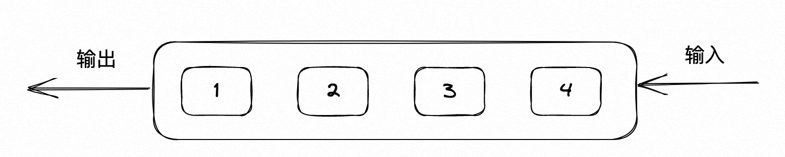
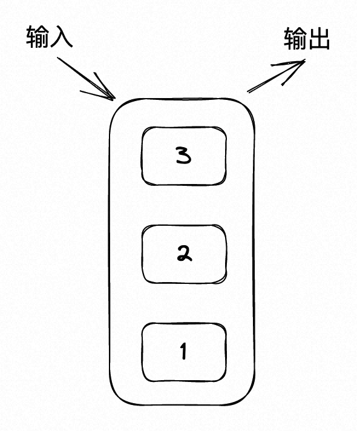
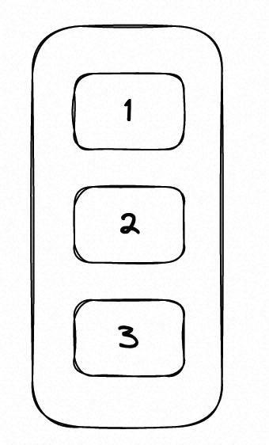
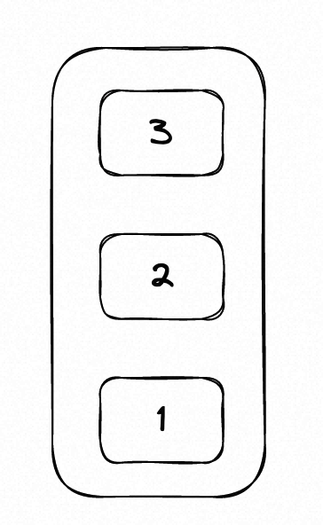
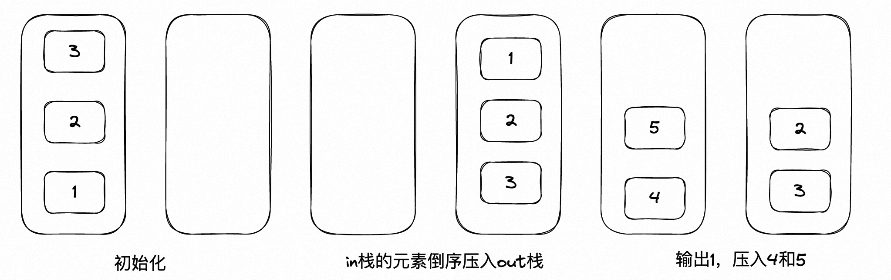
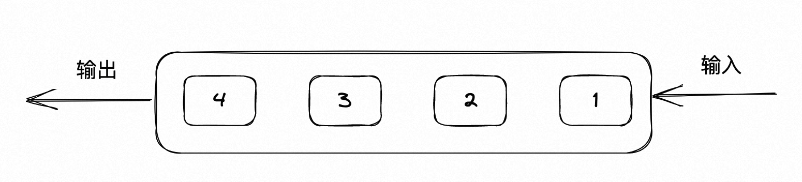
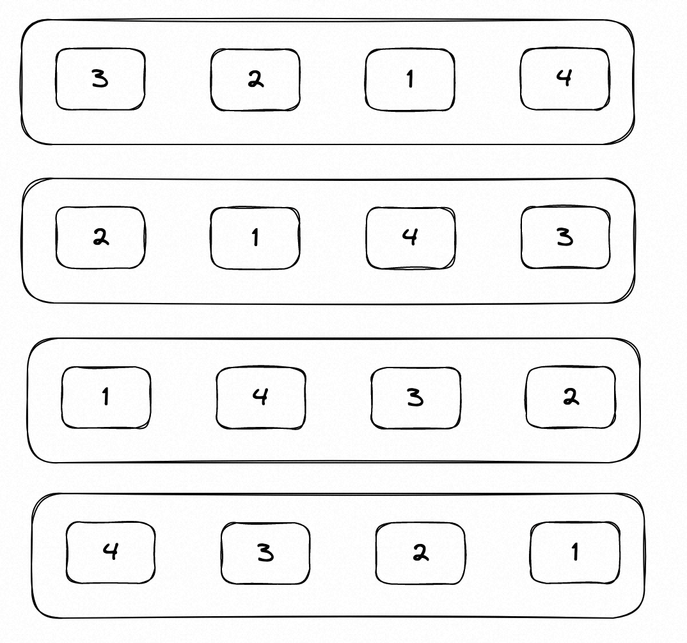

# 第十天 ｜ 232、用栈实现队列 225、用队列实现栈

## 232 用栈实现队列

#### 题目

题目链接：https://leetcode.cn/problems/implement-queue-using-stacks/

使用栈实现队列的下列操作：

push(x) -- 将一个元素放入队列的尾部。
pop() -- 从队列首部移除元素。
peek() -- 返回队列首部的元素。
empty() -- 返回队列是否为空。

#### 思路

队列是先入先出，如下图所示。



而栈是先入后出，如下图所示。



下面使用栈来模拟一下队列的输出，假设输入是1、2和3，只有栈这样存放这3个数据，才可以实现先入先出。



但是，如果输入是1、2和3，栈本身只能这样存放这3个数据。如何将下面这张图，给变成上面这张图，就是本题所考察的内容。



想要实现让栈的数据倒叙存储，只能从第一个栈顶端将元素取出来，放到另一个栈的栈底，不断循环，直到第一个栈为空。可以看到，如果仅仅用一个栈，是一定不行的，本题需要两个栈。

设置一个in栈，用来存放push的数据，设置一个out栈，用来存放pop的数据。当需要取出数据的时候，就把in栈的元素倒序压入out栈中，再从out的顶部pop出去，直到out的数据被取完，才会再次从in栈中获取数据。




#### 代码

```cpp
class MyQueue {
public:
    /** Initialize your data structure here. */
    MyQueue() {

    }
    /** Push element x to the back of queue. */
    void push(int x) {
        in.push(x);
    }

    /** Removes the element from in front of queue and returns that element. */
    int pop() {
        int res;
        // 如果输出栈没有元素的话，就把输入栈所有元素拿过来
        if (out.empty()) {
            while (!in.empty()) {
                int top = in.top();
                in.pop();
                out.push(top);
            }
            res = out.top();
            out.pop();
        }
        // 如果输出栈有元素的话，就直接输出
        else {
            res = out.top();
            out.pop();
        }
        return res;
    }

    /** Get the front element. */
    int peek() {
        int res = this->pop();
        out.push(res);
        return res;
    }

    /** Returns whether the queue is empty. */
    bool empty() {
        return in.empty() && out.empty();
    }
private:
    stack<int> in;
    stack<int> out;
};
```

## 225 用队列实现栈

#### 题目

题目链接：https://leetcode.cn/problems/implement-stack-using-queues/

使用队列实现栈的下列操作：

push(x) -- 元素 x 入栈
pop() -- 移除栈顶元素
top() -- 获取栈顶元素
empty() -- 返回栈是否为空

#### 思路

栈是先入后出，如下图所示。


队列是先入先出，如下图所示。


下面使用队列来模拟一下栈的输出，假设输入是1、2、3和4，只有队列这样存放这3个数据，才可以实现先入后出。



但是队列是先入先出的，存放数据应该如下图所示。如何将下面这张图变成上面这张图，就是本题考察的内容。


当队列的末尾压入一个数a的时候，为了让它能到队列的最前面，需要将队列其他数都取出来，再依次压入到队列的末尾，如下图所示。



当队列的末尾每压入一个数时，就执行一遍上面的操作，就可以保证pop的时候，是后入先出的（先入后出）。

#### 代码

```cpp
class MyStack {
public:
    /** Initialize your data structure here. */
    MyStack() {
    }
    /** Push element x onto stack. */
    void push(int x) {
        int size = que.size();
        que.push(x);
        while (size--) {
            int y = que.front();
            que.pop();
            que.push(y);
        }
    }
    /** Removes the element on top of the stack and returns that element. */
    int pop() {
        int y = que.front();
        que.pop();
        return y;
    }

    /** Get the top element. */
    int top() {
        int y = que.front();
        return y;
    }

    /** Returns whether the stack is empty. */
    bool empty() {
        return que.empty();
    }
private:
    queue<int> que;
};
```