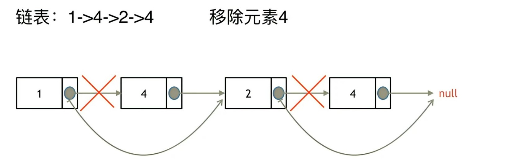

# 第三天 | 203.移除链表元素、707.设计链表、 206.反转链表

## 203 移除链表元素

#### 题目

​		题目链接：[203. 移除链表元素 - 力扣（LeetCode）](https://leetcode.cn/problems/remove-linked-list-elements/)

​		给你一个链表的头节点 `head` 和一个整数 `val` ，请你删除链表中所有满足 `Node.val == val` 的节点，并返回新的头节点 。

#### 思路

​		想要删除一个节点B，就要找到这个节点B之前的节点A，让节点A直接指向节点B的后一个节点C，如下图所示。



​		但是这样就会带来一个问题，对于第一个节点，并不存在在它之前的节点。这时就用到**虚拟头节点**，如下图所示。


​		注意，在删除操作完成之后，虚拟头节点的下一个节点才是新的头节点。

#### 代码

```cpp
class Solution {
public:
    ListNode* removeElements(ListNode* head, int val) {
        if (!head)
            return head;
        // 设置虚拟头节点，用于应对删除第一个节点的情况
        ListNode* dummy = new ListNode();
        dummy->next = head;
         // 设置一个循环遍历p，从前往后循环链表
        ListNode* p = new ListNode();
        p = dummy;
        while (p->next != NULL)
        {
            if (p->next->val == val) {
                p->next = p->next->next;
            }
            else {
                p = p->next; 
            }
        }
        return dummy->next;
    }
};
```

## 707 设计链表

#### 题目

​		题目链接：[707. 设计链表 - 力扣（LeetCode）](https://leetcode.cn/problems/design-linked-list/)

​		你可以选择使用单链表或者双链表，设计并实现自己的链表。

​		单链表中的节点应该具备两个属性：`val` 和 `next` 。`val` 是当前节点的值，`next` 是指向下一个节点的指针/引用。

​		如果是双向链表，则还需要属性 `prev` 以指示链表中的上一个节点。假设链表中的所有节点下标从 **0** 开始。

​		实现 `MyLinkedList` 类：

- `MyLinkedList()` 初始化 `MyLinkedList` 对象。
- `int get(int index)` 获取链表中下标为 `index` 的节点的值。如果下标无效，则返回 `-1` 。
- `void addAtHead(int val)` 将一个值为 `val` 的节点插入到链表中第一个元素之前。在插入完成后，新节点会成为链表的第一个节点。
- `void addAtTail(int val)` 将一个值为 `val` 的节点追加到链表中作为链表的最后一个元素。
- `void addAtIndex(int index, int val)` 将一个值为 `val` 的节点插入到链表中下标为 `index` 的节点之前。如果 `index` 等于链表的长度，那么该节点会被追加到链表的末尾。如果 `index` 比长度更大，该节点将 **不会插入** 到链表中。
- `void deleteAtIndex(int index)` 如果下标有效，则删除链表中下标为 `index` 的节点。

#### 思路

​		对于MyLinkedList构造函数，初始化一个头节点。注意，由于题目给出的案例在初始化之后，链表仍为空，可以看出，这个头节点应该是一个**虚拟头节点**，并不计算进链表中。

​		对于get函数，设置一个遍历节点遍历列表，将找到的第index个节点返回。

​		对于addAtHead函数，创建一个节点，并将其添加到虚拟头节点之后。

​		对于addAtTail函数，先找到链接最后一个节点，再创建一个节点，让之前的最后一个节点指向它。

​		对于addAtIndex函数，先遍历列表，找到下标为index-1的节点，再创建节点，让下标为index-1指向新创建的节点。

​		对于deleteAtIndex函数，先遍历列表，找到下标为index-1的节点，再让下标为index-1的节点指向下表为index+1的节点。

#### 代码

```cpp
class MyLinkedList {
public:
    MyLinkedList() {
        size = 0;
        head = new ListNode();
    }

    int get(int index) {
        if (index >= size || index < 0)
            return -1;
        ListNode* p = head;
        int cur_index = -1;
        while(cur_index != index) {
            p = p->next;
            cur_index++;
        }
        return p->val;
    }

    void addAtHead(int val) {
        ListNode* p = new ListNode(val);
        p->next = head->next;
        head->next = p;
        size++;
    }

    void addAtTail(int val) {
        ListNode* p = new ListNode(val);
        ListNode* p_last = head;
        while (p_last->next != NULL) {
            p_last = p_last->next;
        }
        p_last->next = p;
        size++;
    }

    void addAtIndex(int index, int val) {
        if (index > size || index < 0)
            return;
        ListNode* p = new ListNode(val);
        ListNode* p_index = head;
        int cur_index = -1;
        while (cur_index != index - 1) {
            p_index = p_index->next;
            cur_index++;
        }
        p->next = p_index->next;
        p_index->next = p;
        size++;
    }

    void deleteAtIndex(int index) {
        if (index >= size || index < 0)
            return;
        ListNode* p_index = head;
        int cur_index = -1;
        while(cur_index != index - 1) {
            p_index = p_index->next;
            cur_index++;
        }
        p_index->next = p_index->next->next;
        size--;
    }
private:
    int size;
    ListNode* head;
};
```

## 206 反转指针

#### 题目

​		题目链接：[206. 反转链表 - 力扣（LeetCode）](https://leetcode.cn/problems/reverse-linked-list/)

​		给你单链表的头节点 `head` ，请你反转链表，并返回反转后的链表。

#### 思路

​		本题要将链表反转过来，其实就是改变所有指针的指向，对于p1->p2的指针，将方向反过来变成p1<-p2即可。

​		在这个反转过程中，需要使用两个指针pre和cur指针（**双指针法**），cur指针代表后面的节点，pre指针代表前面的节点。将cur节点的指针，指向pre节点即可。注意在这个操作之前，需要保存一下cur的下一个节点，因为反转之后，next变化，就到不了原来cur的下一个节点了。


#### 代码

```cpp
class Solution {
public:
    ListNode* reverseList(ListNode* head) {
        if (!head)
            return head;
        ListNode* p1 = new ListNode();
        ListNode* p2 = new ListNode();
        p1 = head;
        p2 = head->next;
        // 手动将第一个节点反转过来
        p1->next = nullptr;
        // 从第二个节点开始反转
        while (p2!=NULL) {
            ListNode* p3 = p2->next;
            p2->next = p1;
            p1 = p2;
            p2 = p3;
        }
        return p1;
    }
};
```


