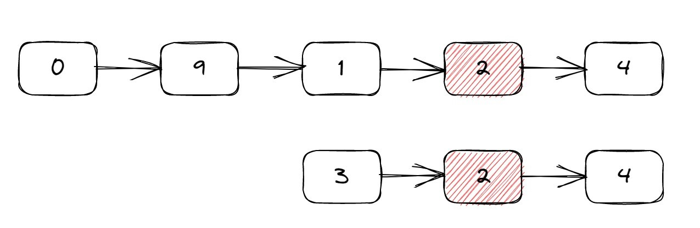
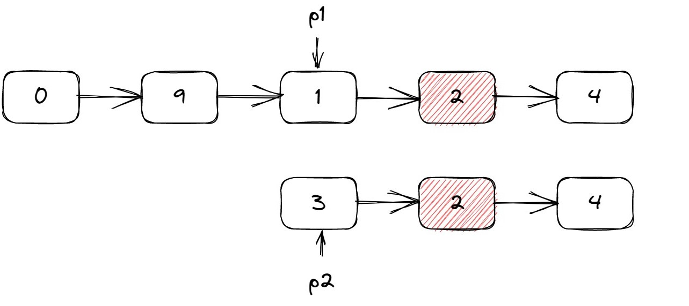
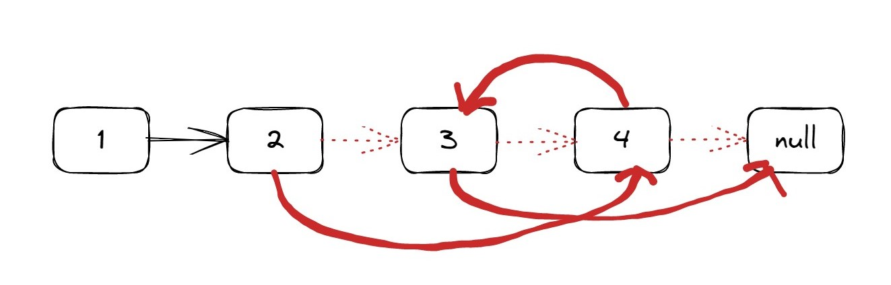
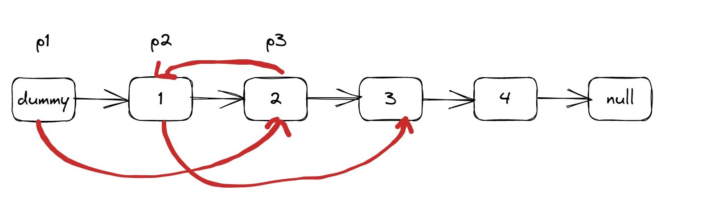
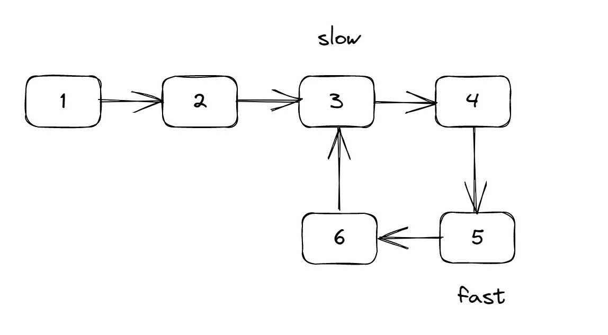
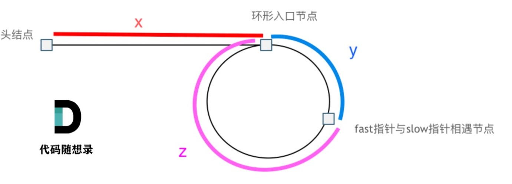

# 第四天 | 160、链表相交 24、两两交换链表中的节点 19、删除链表的倒数第N个节点 142、环形链表II

## 160 链表相交

#### 题目

​		题目链接：[面试题 02.07. 链表相交 - 力扣（LeetCode）](https://leetcode.cn/problems/intersection-of-two-linked-lists-lcci/)

​		给你两个单链表的头节点 `headA` 和 `headB` ，请你找出并返回两个单链表相交的起始节点。如果两个链表没有交点，返回 `null` 。

#### 思路

​		这题的本质是寻找一个节点，这个节点存在链表A，也存在链表B。因此，最开始想到的办法就是，设置一个set（**哈希表法**），将链表A的节点都放进去，然后循环链表B，看链表B的节点是否在set中。该方法时间复杂度O(m+n)，空间复杂度O(m)。

​		看到题目提示的进阶，说可以使用空间复杂度为O(1)的方法解决，那就考虑**双指针**来解决。

​		如果使用双指针，那么要解决的问题就是，这两个指针是什么关系，要如何进行移动。观察链表发现，如果链表相交，那从相交位置开始以后的节点都是一样的，也就是说，相交节点距离这两个链表的结束位置的长度都是一样的。



​		考虑到这个特性，可以让一个指针指向更短链表的头节点；让另一个指针指向两个链表长度之差的位置。如下图所示。



​		这样，两个指针距离交点的大小是一样的，那就可以比较两个指针的节点是否相等，如果不相等，两个指针同时往后移动。

#### 代码

​		哈希表

```cpp
class Solution {
public:
    ListNode *getIntersectionNode(ListNode *headA, ListNode *headB) {
        ListNode *pa = headA;
        ListNode *pb = headB;
        unordered_set<ListNode *> nodeA;
        while (pa != nullptr) {
            nodeA.insert(pa);
            pa = pa->next;
        }
        while (pb != nullptr) {
            if (nodeA.count(pb) == 1)
                return pb;
            pb = pb->next;
        }
        return NULL;
    }
};
```

​		双指针

```cpp
class Solution {
public:
    ListNode *getIntersectionNode(ListNode *headA, ListNode *headB) {
        ListNode *pa = headA;
        ListNode *pb = headB;
        int nA = 0;
        int nB = 0;
        while (pa != nullptr) {
            nA++;
            pa = pa->next;
        }
        while (pb != nullptr) {
            nB++;
            pb = pb->next;
        }
        ListNode *p1;
        ListNode *p2;
        p2 = nA >= nB ? headB : headA;
        if (nA >= nB) {
            int sub = nA - nB;
            p1 = headA;
            while ( sub-- )
            {
                p1 = p1->next;
            }
        }
        else {
            int sub = nB - nA;
            p1 = headB;
            while ( sub-- )
            {
                p1 = p1->next;
            }
        }
        while (p1 != nullptr && p2 != nullptr)
        {
            if (p1 == p2)
                return p1;
            p1 = p1->next;
            p2 = p2->next;
        }
        return NULL;
    }
};
```

## 24 两两交换链表中的节点

#### 题目

​		题目链接：[24. 两两交换链表中的节点 - 力扣（LeetCode）](https://leetcode.cn/problems/swap-nodes-in-pairs/)

​		给定一个链表，两两交换其中相邻的节点，并返回交换后的链表。

​		你不能只是单纯的改变节点内部的值，而是需要实际的进行节点交换。

#### 思路

​		观察链表发现，如果想要交换两个节点，需要对3个指针进行修改。



​		那就要设置3个指针，分别指向需要交换的两个节点，和交换节点之前的那个节点。注意，在头节点之前，还需要再设置一个虚拟头节点，用于交换前两个节点。



#### 代码

```cpp
class Solution {
public:
    ListNode* swapPairs(ListNode* head) {
        if (head == nullptr || head->next == nullptr)
            return head;
        // 设置一个不动的虚拟头节点，用于保存修改后链表的头节点
        ListNode* dummy = new ListNode(0, head);
        ListNode* p1 = dummy;
        ListNode* p2 = head;
        ListNode* p3 = new ListNode();
        // 如果出现奇数个节点的情况，p2不为空，但是p2->next为空。这种情况也需要直接结束
        while (p2 != nullptr && p2->next != nullptr) {
            // 先判断p2不为空之后，在设置p3。因为如果p2为空，这句话就会执行出错
            p3 = p2->next;
            p1->next = p3;
            p2->next = p3->next;
            p3->next = p2;
            p1 = p2;
            p2 = p2->next;
        }
        return dummy->next;
    }
};
```

## 19 删除链表的倒数第N个节点

#### 题目

​		题目链接：[19. 删除链表的倒数第 N 个结点 - 力扣（LeetCode）](https://leetcode.cn/problems/remove-nth-node-from-end-of-list/)

​		给你一个链表，删除链表的倒数第 n 个结点，并且返回链表的头结点。

#### 思路

​		本题最简单的方法就是，先扫描一遍，得到节点长度m，再让m-n，得到倒数第N个节点是正数的第几个，再从头遍历一遍。

​		进阶提示，可以只用一次遍历就得到结果。考虑使用双指针，让快指针领先慢指针N个节点，当快指针为空时，慢指针处于倒数第N个位置上。

#### 代码

​		扫描两次

```cpp
class Solution {
public:
    ListNode* removeNthFromEnd(ListNode* head, int n) {
        if (head == nullptr)
            return head;
        // 先获取链表长度
        ListNode* p = head;
        int m = 0;
        while (p != nullptr)
        {
            m++;
            p = p->next;
        }
        // 知道要删除的是正数第几个，并让指针指向它
        int sub = m - n;
        // 如果删第一个，就需要设置一个虚拟头节点
        ListNode* dummy = new ListNode();
        dummy->next = head;
        p = dummy;
        int cur = 0;
        while (cur != sub)
        {
            p = p->next;
            cur++;
        }
        // 删除
        p->next = p->next->next;
        return dummy->next;
    }
};
```

​		双指针

```cpp
class Solution {
public:
    ListNode* removeNthFromEnd(ListNode* head, int n) {
        ListNode* fast = new ListNode();
        ListNode* slow = new ListNode();
        // 由于可能要删除头节点，所以设置一个虚拟头节点来保存新的头节点位置
        ListNode* dummy = new ListNode();
        dummy->next = head;
        fast->next = dummy;
        slow->next = dummy;
        while (n) {
            fast = fast->next;
            n--;
        }
        while (fast->next != nullptr)
        {
            fast = fast->next;
            slow = slow->next;
        }
        slow->next = slow->next->next;
        return dummy->next;
    }
};
```


## 142.环形链表II

#### 题目

​		题目链接：[142. 环形链表 II - 力扣（LeetCode）](https://leetcode.cn/problems/linked-list-cycle-ii/)

​		给定一个链表，返回链表开始入环的第一个节点。 如果链表无环，则返回 null。

​		为了表示给定链表中的环，使用整数 pos 来表示链表尾连接到链表中的位置（索引从 0 开始）。 如果 pos 是 -1，则在该链表中没有环。

#### 思路

##### 如何判断是否有环

​		对于环形链表的题目，可以使用快慢指针来解决。

​		如果是判断是否有环。可以定义 fast 和 slow 指针，从头结点出发，fast指针每次移动两个节点，slow指针每次移动一个节点，如果 fast 和 slow指针在途中相遇 ，说明这个链表有环。

​		因为fast指针指针走得快，所以先进入环。当slow指针进入环的时候，如下图所示。假设他们之间的距离是n，环大小为m，n < m。



​		slow指针一次性走一步，fast指针一次性走两步，他们之间的相对距离随着每次循环-1，再经过n次循环后，二者必定相遇。

##### 如何寻找入口节点

​		当二者相遇后，假设从头结点到环形入口节点的节点数为x。 环形入口节点到fast指针与slow指针相遇节点的节点数为y。 从相遇节点 再到环形入口节点节点数为z。如下图所示。



​		相遇时，slow指针走的距离是x+y，fast指针走的距离是x+n(y+z)+y，其中n是fast指针在环中走的圈数。因为fast指针是一步走两个节点，slow指针一步走一个节点， 所以 fast指针走过的节点数 = slow指针走过的节点数 * 2：
$$
(x + y) * 2 = x + y + n (y + z)
$$
​		化简可得：
$$
x = (n - 1) (y + z) + z
$$
​		从这个公式可以看出，如果存在一个指针，从头节点走x步，可以到达入口节点；同时slow指针也走x步，也就是slow指针走了(n - 1) (y + z) + z，也就是围绕环走了n-1圈，又多走了z步，也可以到达入口节点。这两个指针会在入口节点相遇。

​		而由于我们并不知道x的大小，因此直接让一个指针从头节点开始走，一个slow指针开始走，他们相遇的地方，就是入口节点。

​		综上所述，本题主要考查数学公式。代码只需要先使用快慢指针找到相交节点，再从头节点初始化一个节点再次遍历，再找到第二个相交节点。这个节点就是入口节点。

##### 如何计算环的大小

​		使用快慢节点找到相交节点后，两个指针都处于环中。设环大小为L，让slow走1步，fast走2步，那二者之间的相对距离就是L-1。接下来，还是按照slow指针一次性走一步，fast指针一次性走两步，他们之间的相对距离随着每次循环-1，再经过L-1次循环后，二者必定相遇。因此，只需要经过L次循环，二者必定再次相遇。

​		因此，想要计算环的大小，只需要再找到相交节点后，让快慢指针再绕着环走一遍，再次相遇所需要的循环次数，就是环的大小。

#### 代码

```cpp
class Solution {
public:
    ListNode *detectCycle(ListNode *head) {
        ListNode* slow = head;
        ListNode* fast = head;
        while (fast != nullptr && fast->next != nullptr && slow != nullptr) {
            fast = fast->next->next;
            slow = slow->next;
            if (fast == slow) {
                ListNode* p = head;
                while (p != slow) {
                    p = p->next;
                    slow = slow->next;
                }
                return p;
            }
        }
        return nullptr;
    }
};
```


