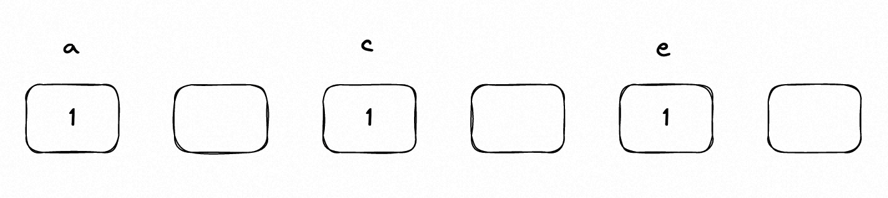

# 第六天 | 242、有效的字母异位词 349、两个数组的交集 202、快乐数 1、两数之和

## 哈希表知识点总结

哈希表就是散列表，可以通过散列函数将数据ace散列到一个表中，如下图所示。



常见的哈希表有set和map。set是集合，只用来存放value；map是映射，可以用于存放键值对，key: value。

set分别提供以下三种数据结构，其底层实现以及优劣如下表所示：

| 集合            | 底层实现 | 是否有序 | 是否自动去重 | 能否更改数值 | 查询效率 | 增删效率 |
| --------------- | -------- | -------- | ---------------- | ------------ | -------- | -------- |
| set         | 红黑树   | 有序     | 是               |否           | O(log n) | O(log n) |
| multiset    | 红黑树   | 有序     | 否               |否           | O(logn)  | O(logn)  |
| unordered_set | 哈希表   | 无序     | 是               |否           | O(1)     | O(1)   |

一般情况下优先使用unordered_set，它可以去重，但不会自动排序，并且查询和增删效率是最优的；如果要求自动排序的话，就使用set，它可以自动排序并去重；如果要求不去重，就使用multiset，它不去重，但可以自动排序。

map分别提供以下三种数据结构，其底层实现以及优劣如下表所示：

| 映射               | 底层实现 | 是否有序 | 数值是否可以重复 | 能否更改数值 | 查询效率 | 增删效率 |
| ------------------ | -------- | -------- | ---------------- | ------------ | -------- | -------- |
| map           | 红黑树   | key有序  | key不可重复      | key不可修改  | O(logn)  | O(logn)  |
| multimap      | 红黑树   | key有序  | key可重复        | key不可修改  | O(log n) | O(log n) |
| unordered_map | 哈希表   | key无序  | key不可重复      | key不可修改  | O(1)     | O(1)    |

一般情况下优先使用unordered_map，它要求不能有两个一样的key，但不会自动排序，并且查询和增删效率是最优的；如果要求自动排序的话，就使用map，它可以自动排序，要求不能有两个一样的key；如果要求多个一样的key，就使用multimap，它可以有多个一样的key，且可以自动排序。

**总结一下，当我们遇到了要快速判断一个元素是否出现集合里（一个元素是否出现过）的时候，就要考虑哈希法。**

下面是哈希表常用的函数

```cpp
// 初始化一个map
unordered_map<char, int> map;

// 给一个map赋值键值对a:1
map[a] = 1;

// 快速判断map中是否有键a
if (map.count(a)) 

// 初始化一个set
unordered_set<int> set;

// 初始化一个set，并将num数组放到set中
unordered_set<int> num(nums.begin(), nums.end());

// 初始化一个数组，将一个set集合放到数组中
vector<int> vec(set.begin(), set.end());

//往set中插入元素a
set.insert(a);

// 快速判断一个set中是否存在元素a
if (set.count(a))
```

## 242 有效的字母异位词

#### 题目

题目链接：https://leetcode.cn/problems/valid-anagram/

给定两个字符串 s 和 t ，编写一个函数来判断 t 是否是 s 的字母异位词。

示例 1: 输入: s = "anagram", t = "nagaram" 输出: true

示例 2: 输入: s = "rat", t = "car" 输出: false

#### 思路

如果是字母异位词，说明所有字母出现的次数是一样的，那就考虑使用map存放字母出现次数。

首先，如果两个字符串长度不一样，那必然不是字母异位词，直接输出。如果长度一样，且不是字母异位词，那只有一种情况，就是t中存在某一个字母不在s里面。

让s的字母出现次数放到map中，再次循环字符串t，每出现一个字符，就在map中减1，如果发现有一个value为-1，那必然这个字母不在s中出现，在t中出现了（在s中的出现次数小于t中出现次数），直接输出结果，不是字母异位词。只要不出现这种情况，那就是字母异位词。

#### 代码

```cpp
class Solution {
public:
    bool isAnagram(string s, string t) {
        // 如果长度不一样，肯定不是
        if (s.size() != t.size())
            return false;
        unordered_map<char, int> words;
        for (int i = 0; i < s.size(); i++) {
            words[s[i]]++;
        }
        for (int i = 0; i < t.size(); i++) {
            words[t[i]]--;
            // 由于长度相等，不是字母异位词的情况只有下述情况
            // 如果一个字符在t不在s，肯定不是字母异位词
            if (words[t[i]] < 0)
                return false;
        }
        return true;
    }
};
```

## 349 两个数组的交集

#### 题目

题目链接：https://leetcode.cn/problems/intersection-of-two-arrays/

给定两个数组，编写一个函数来计算它们的交集。

#### 思路

本题最简单的方法就是暴力破解，使用双层循环遍历两个数字，第一层循环指向第一个数组元素，第二层循环遍历第二个数组，判断元素是否在第二个数组里面。就发现，第二个循环的作用是判断一个数是否在数组里面，完全可以使用unordered_set来快速判断数字是否在集合中。

因此，可以将一个数组给放到unordered_set中，然后再循环另外一个数组的元素，看元素是否在unordered_set中（可使用count函数），时间复杂度为O(n)。

#### 代码

```cpp
class Solution {
public:
    vector<int> intersection(vector<int>& nums1, vector<int>& nums2) {
        // 由于最后的结果是去重的，使用set来存结果进行去重
        unordered_set<int> res;
        // 直接将vector存入到set中，自动去重
        unordered_set<int> num(nums1.begin(), nums1.end());
        for (int i = 0; i < nums2.size(); i++) {
            if (num.count(nums2[i]) >= 1) {
                // 由于题目输出的结果是去重的，利用unordered_set自动去重的特点，现将结果存到unordered_set中
                res.insert(nums2[i]);
            }
        }
        // 直接将unordered_set转为vector输出
        return vector<int>(res.begin(), res.end());
    }
};
```

## 202 快乐数

#### 题目

题目链接：https://leetcode.cn/problems/happy-number/

编写一个算法来判断一个数 n 是不是快乐数。

「快乐数」定义为：对于一个正整数，每一次将该数替换为它每个位置上的数字的平方和，然后重复这个过程直到这个数变为 1，也可能是 无限循环 但始终变不到 1。如果 可以变为  1，那么这个数就是快乐数。

如果 n 是快乐数就返回 True ；不是，则返回 False 。

示例：

输入：19
输出：true
解释：
1^2 + 9^2 = 82
8^2 + 2^2 = 68
6^2 + 8^2 = 100
1^2 + 0^2 + 0^2 = 1

#### 思路

本题一开始看到也没有思路，然后找了一个非快乐数的数计算了一下，发现如果无限循环的话，那这个数字必定是循环出现的。比如计算12，平方后再求和的结果分别是：5 25 29 85 89 145 42 20 4 16 37 58 89。注意到，89在之前已经出现过一次了，第二次出现，那就会造成不断在89-58之间循环，最后无限循环，且到不了1。

因此，为快乐数的条件应该是平方后再求和的结果是1；而非快乐数的条件是，在平方后再求和的过程中，出现了和之前一样的数字。这时就考虑可以使用set来快速判断一个数字有没有出现过。

时间复杂度为O(logn)。因为平方后再求和需要得到数字的每一位，对于数字n，长度是logn，因此平方后再求和的复杂度为O(logn)。

```cpp
class Solution {
public:
    int gethappy(int n) {
        int sum = 0;
        int remain = 0;
        while (n) {
            remain = n % 10;
            n = n / 10;
            sum = sum + remain*remain;
        }
        return sum;
    }
    bool isHappy(int n) {
        unordered_set<int> set;
        while(1) {
            n = gethappy(n);
            // 如果等于1，那就是快乐数
            if (n == 1) 
                return true;
            // 发现这个数字之前出现过，数字开始循环，说明肯定无限循环，但始终变不到1
            if (set.count(n))
                return false;
            else {
                set.insert(n);
            }
        }
    }
};
```

## 1 两数之和

#### 题目

题目链接：https://leetcode.cn/problems/two-sum/

给定一个整数数组 nums 和一个目标值 target，请你在该数组中找出和为目标值的那 两个 整数，并返回他们的数组下标。

你可以假设每种输入只会对应一个答案。但是，数组中同一个元素不能使用两遍。


#### 思路

本题最简单的方法就是暴力破解，使用第一个循环定位一个元素i，再使用第二个循环去判断元素j是不是target - i。题目说同一个元素不能使用两遍，也就是不希望循环两次，那就需要对这个方法进行优化。

这时想到，**当我们需要查询一个元素是否出现过，或者一个元素是否在集合里的时候，就使用哈希法。**

可以使用set来替代第二个循环，快速判断target - i是否在集合中，这样时间复杂度就是O(n)。

但是注意一点，题目要求返回下标，所以仅仅使用set是不够的，因为set中只包括value，没办法建立元素和下标的对应关系。就考虑使用map来替代set，让key存放元素，value存放下标。

#### 代码

```cpp
class Solution {
public:
    vector<int> twoSum(vector<int>& nums, int target) {
        unordered_map<int, int> map;
        vector<int> res;
        map[nums[0]] = 0;
        for (int i = 1; i < nums.size(); i++) {
            int add = target - nums[i];
            // 看target - nums[i]是否在map中，如果在就可以输出结果
            if (map.count(add)) {
                res.push_back(map[add]);
                res.push_back(i);
                break;
            }
            // 看target - nums[i]是否在map中，如果不在，就把nums[i]放到map中
            else {
                map[nums[i]] = i;
            }
        }
        return res;
    }
};
```