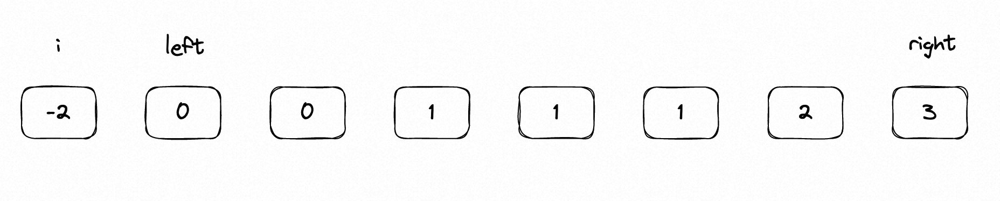
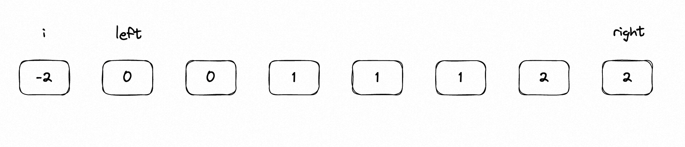

# 第七天 ｜ 454、四数相加II 383、赎金信 15、三数之和 18、四数之和

## 454 四数相加II

#### 题目

题目链接：https://leetcode.cn/problems/4sum-ii/

给定四个包含整数的数组列表 A , B , C , D ,计算有多少个元组 (i, j, k, l) ，使得 A[i] + B[j] + C[k] + D[l] = 0。

为了使问题简单化，所有的 A, B, C, D 具有相同的长度 N，且 0 ≤ N ≤ 500 。所有整数的范围在 -2^28 到 2^28 - 1 之间，最终结果不会超过 2^31 - 1 。

例如:

输入:

A = [ 1, 2]
B = [-2,-1]
C = [-1, 2]
D = [ 0, 2]
输出:

2

解释:

两个元组如下:

(0, 0, 0, 1) -> A[0] + B[0] + C[0] + D[1] = 1 + (-2) + (-1) + 2 = 0
(1, 1, 0, 0) -> A[1] + B[1] + C[0] + D[0] = 2 + (-1) + (-1) + 0 = 0

#### 思路

看到这题，其实想到我们之前做的一个两数之和，判断两个数字相加是不是为target（0）。其实这题也是一样，区别就在于，是判断4个数字相加是不是0。

最简单的方法就是暴力破解，循环四次，时间复杂度为O(n^4)。

其实可以将这题的a+b看作是一个数，c+d看作是一个数，那这题就和两数之和一样了，可以使用map来存一个数（a+b），循环另外一个数（c+d），通过map来快速判断-c-d是否在map中，这样时间复杂度就变成了O(n^2)。

这里使用map的原因是，题目要求输出有几种可能，所以需要将a+b产生的次数也存下来。

#### 代码

```cpp
class Solution {
public:
    int fourSumCount(vector<int>& A, vector<int>& B, vector<int>& C, vector<int>& D) {
        unordered_map<int, int> mapab;
        int count = 0;
        // 先把a+b的所有可能存到map中，因为题目要求返回次数，所以要把次数作为value存下来。
        for (int i = 0; i < A.size(); i++) {
            for (int j = 0; j < B.size(); j++) {
                int add = A[i] + B[j];
                mapab[add]++;
            }
        }
        // 遍历所有可能的c+d，判断-c-d在不在map里面
        for (int i = 0; i < C.size(); i++) {
            for (int j = 0; j < D.size(); j++) {
                int add = C[i] + D[j];
                int sub = 0 - add;
                if (mapab.count(sub)) {
                    count = count + mapab[sub];
                }
            }
        }
        return count;
    }
};
```

## 383 赎金信

#### 题目

题目链接：https://leetcode.cn/problems/ransom-note/

给定一个赎金信 (ransom) 字符串和一个杂志(magazine)字符串，判断第一个字符串 ransom 能不能由第二个字符串 magazines 里面的字符构成。如果可以构成，返回 true ；否则返回 false。

(题目说明：为了不暴露赎金信字迹，要从杂志上搜索各个需要的字母，组成单词来表达意思。杂志字符串中的每个字符只能在赎金信字符串中使用一次。)

你可以假设两个字符串均只含有小写字母。

canConstruct("a", "b") -> false
canConstruct("aa", "ab") -> false
canConstruct("aa", "aab") -> true

#### 思路

这题和之前做过的一个字母异位词思路一样，可以采用一个map来存放magazine的字符和字符出现次数，然后遍历ransom字符，每使用一个ransom字符，就在map中对应的字符的value减去1。如果map中出现value为-1的情况，说明这个字符在magazine中出现次数小于ransom中出现次数，返回false。

#### 代码

```cpp
class Solution {
public:
    bool canConstruct(string ransomNote, string magazine) {
        unordered_map<char, int> map;
        // 记录magazine的字符和字符出现次数
        for (int i = 0; i < magazine.size(); i++) {
            map[magazine[i]]++;
        }
        // 每使用一个ransom字符，就在map中对应的字符的value减去1
        for (int i = 0; i < ransomNote.size(); i++) {
            map[ransomNote[i]]--;
            // 说明这个字符在magazine中出现次数小于ransom中出现次数，返回false
            if (map[ransomNote[i]] == -1)
                return false;
        }
        return true;
    }
};
```

## 15 三数之和

#### 题目

题目链接：https://leetcode.cn/problems/3sum/

给你一个包含 n 个整数的数组 nums，判断 nums 中是否存在三个元素 a，b，c ，使得 a + b + c = 0 ？请你找出所有满足条件且不重复的三元组。

注意： 答案中不可以包含重复的三元组。

示例：

给定数组 nums = [-1, 0, 1, 2, -1, -4]，

满足要求的三元组集合为： [ [-1, 0, 1], [-1, -1, 2] ]

#### 思路

##### 哈希法

这题的思路和前面的四数相加类似，使用哈希法解决。可以先将nums放到set中，然后双层循环计算a+b，然后去map中去找有没有-a-b，这样就可以使用O(n^2)的方式解决这题。但是注意，本题的细节很多，a b c的下标必须不同，因此考虑使用map来存放c的下标。同时三元组不能重复，最后的结果还需要去重。

本题如果采用哈希法的话，做起来难度较大，考虑使用排序+双指针的方法。将三重循环，使用双指针来替换掉其中的两层循环。

##### 排序+双指针思路

使用第一层循环去遍历元素i（其实就是去寻找a），然后在第二层循环中使用使用left和right（其实就是把2层循环干的事情压缩到一层循环），用left和right去寻找b和c。



这里注意一点，数组必须先排序，有两个原因：

- 数组排序后，数字有大小关系，可以利用这个大小关系移动left和rigit指针。
- 数组排序后，a b c也就有了顺序，a<=b<=c，这样就完成了一次去重操作，保证不会出现（-1，0，1）和（1，0，-1）同时出现的情况，相同数组放一起，也方便后续进行去重。

让left从i+1开始，right从size()-1开始，因为数组是有序的，那abc必定有一个在数组前面，一个在数组中间，一个在数组后面。当i+left+right大于0时，说明right大了，right向前移动；当i+left+right小于0时，说明left小了，left向后移动。

##### 去重

对于去重，注意，题目要求是不能出现两个相同的三元组，也就是不能让（-1，0，1）和（-1，0，1）同时出现。为了解决这个问题，在进行遍历的时候，i在进行循环的时候，要保证不和前面出现过的i相同，如果相同了，那就有可能找到相同的left和right，最后的三元组也是相同的。如下图所示。

之前的i是-1，那left和right就选中了0和1，对应的三元组的（-1，0，1）。如果接下来i循环，到了第二个-1，那么选中的left和right还是0和1，对应的三元组的是（-1，0，1），就出现重复了。所以应该在循环到第二个-1的时候，就判断出和前面出现过的i相同，跳过。


这里注意一点，一定是和前面的数相比是一样的，才能跳过。和后面的数相比一样的，不能跳过。如下图的例子。


如果在第一个-1的时候，发现和后面的数相同了，然后跳过，那么i为-1，left为0，right为2，就找不到三元组了。实际上这里存在一个三元组(-1, -1, 2)。因此，不能这样跳过，这样跳过只是对三元组内部进行了去重，保证i和left不能是同一个数字而已。而比较前面的数字是否相同，才能对三元组直接去重，保证两个a不能是相同的。

关于left和right的去重就相对简单一点。看下面的例子。



可以看到，对于left，将(-2,0,2)加入结果后，如果只是把left往后移动一位，那么下一个b还是0，找到的下一个c还是2，那么就出现两个一样的三元组。因此，在加入一个结果后，必须保证下一个b和上一个b不一样，那就让left和后面的数字比较，如果相同，就让left往后走，直到找到最后一个0为止找到最后一个0后，再往后移动一位，到达第一个和0不同的数）。

同理right也是如此，将(-2,0,2)加入结果后，如果只是把right往前移动一位，那下一个c还是一样的，会出现重复。因此需要比较right和前一个数，如果相同right往前移动，知道找到最后一个2为止（找到最后一个2后，再往前移动一位，到达第一个和2不同的数）

这里要注意，必须先加入结果，再对bc去重。否则对于00000的情况，先去重的话，就会导致left>right，退出循环了。这样就找不到(0,0,0)的三元组。所以必须加入结果，再对bc去重。

##### 和二数之和的比较

本题发现，用双指针法也可以解决几数之和的问题，之前做过一个二数之和，是使用哈希表来做的。那双指针可以解决那题吗？

答案是不可以。一位双指针法要求先排序，而二数之和要求返回下标，如果排序了，下标就乱掉了。如果二数之和不要求返回下标，只要求返回元素，那也可以使用双指针法解决。

#### 代码

```cpp
class Solution {
public:
    vector<vector<int> > threeSum(vector<int>& nums) {
        vector<vector<int> > res;
        if (nums.size() < 3)
            return res;
        // 先排序一波，具体理由见博客的思路部分
        sort(nums.begin(), nums.end());
        // 如果排序后的第一个元素还大于0的话，那必然不可能有相加等于0的三元组
        if (nums[0] > 0)
            return res;
        // 遍历i去寻找a
        for (int i = 0; i < nums.size(); i++) {
            // 当a大于0，由于数组的排序的，三元组第一个元素都大于0了，必然不存在后两个元素，使得和为0
            // 对a进行去重，保证（-1，0，1）和（-1，0，1）不会同时出现，具体理由见博客的思路部分
            if (i > 0 && nums[i] == nums[i-1] || nums[i] > 0)
                continue;
            int a = nums[i];
            int left = i + 1;
            int right = nums.size() - 1;
            // 针对一个确定的a，去寻找b和c
            // left和right不能相等，因为题目说b和c不能说同一个位置的元素
            while (left < right) {
                int b = nums[left];
                int c = nums[right];
                // 说明数字大了，c要小一点
                if (a + b + c > 0) {
                    right--;
                }
                // 说明数字小了，b要大一点
                else if (a + b + c < 0){
                    left++;
                }
                // 找到了三元组相加为0的情况
                else {
                    vector<int> ele;
                    ele.push_back(a);
                    ele.push_back(b);
                    ele.push_back(c);
                    res.push_back(ele);
                    // 对于情况-1 0 0 0 0 0 1 1 1 1 1，将(-1,0,1)加入结果集合后
                    // 需要让left指向最后一个0，否则，下一个找出来的三元组还是(-1,0,1)
                    while (nums[left] == nums[left + 1])
                    {
                        left++;
                    }
                    while (nums[right] == nums[right - 1])
                    {
                        right--;
                    }
                    left++;
                    right--;
                }
            }
        }
        return res;
    }
};
```

## 18 四数之和

#### 题目

题目链接：https://leetcode.cn/problems/4sum/

给定一个包含 n 个整数的数组 nums 和一个目标值 target，判断 nums 中是否存在四个元素 a，b，c 和 d ，使得 a + b + c + d 的值与 target 相等？找出所有满足条件且不重复的四元组。

注意：

答案中不可以包含重复的四元组。

示例： 给定数组 nums = [1, 0, -1, 0, -2, 2]，和 target = 0。 满足要求的四元组集合为： [ [-1, 0, 0, 1], [-2, -1, 1, 2], [-2, 0, 0, 2] ]

#### 思路

本题的思路和三数之和一样，考虑使用排序+双指针的方式进行。先两层循环，去定位a和b，再使用双指针，根据a + b + c + d的值和target的比较，去移动双指针找到c和d。时间复杂度为O(n^3)。

前面还做了一个四数相加的题目，使用哈希表完成，复杂度为O(n^2)。其实本题也可以使用哈希表完成，时间复杂度也是O(n^2)。但是使用哈希表做的话，答案难以去重，最后很容易出错。而四数相加的题目，是四个独立的数组，只要找到A[i] + B[j] + C[k] + D[l] = 0就可以，不用考虑有重复的四个元素相加等于0的情况，所以相对于本题还是简单了不少！

总结一下，**双指针法将时间复杂度：O(n^2)的解法优化为 O(n)的解法。也就是降一个数量级。所以当出现多层循环的时候，可以考虑双指针优化。**

#### 代码

```cpp
class Solution {
public:
    vector<vector<int> > fourSum(vector<int>& nums, int target) {
        vector<vector<int> > res;
        if (nums.size() < 4)
            return res;
        // 排序一波，具体理由见三数之和思路
        sort(nums.begin(), nums.end());
        // 最后3个位置要留给b c d
        for (int i = 0; i < nums.size() - 3; i++) {
            // 对a去重
            if (i > 0 && nums[i] == nums[i-1])
                continue;
            int a = nums[i];
            // 最后2个位置要留给c d
            for (int j = i + 1; j < nums.size() - 2; j++) {
                // 对b去重
                if (j > i + 1 && nums[j] == nums[j-1])
                    continue;
                int b = nums[j];
                int left = j + 1;
                int right = nums.size() - 1;
                while (left < right) {
                    int c = nums[left];
                    int d = nums[right];
                    // 如果a + b + c + d > target，说明这4个数取大了，就让right左移一点
                    if (a + b + c + d > target) {
                        right--;
                    }
                    // 如果a + b + c + d < target，说明这4个数取小了，就让right左移一点
                    else if (a + b + c + d < target) {
                        left++;
                    }
                    else {
                        // 先把结果存下来
                        vector<int> ele;
                        ele.push_back(a);
                        ele.push_back(b);
                        ele.push_back(c);
                        ele.push_back(d);
                        res.push_back(ele);
                        // 然后对c去重，下一个c不能和这一个c相同
                        // 先找到最后一个相同的c
                        while (nums[left] == nums[left + 1])
                        {
                            left++;
                        }
                        // 然后对d去重，下一个d不能和这一个d相同
                        // 先找到最后一个相同的d
                        while (nums[right] == nums[right - 1])
                        {
                            right--;
                        }
                        // 让下一个c和d和现在的cd不同
                        left++;
                        right--;
                    }
                }
            }
        }
        return res;
    }
};
```