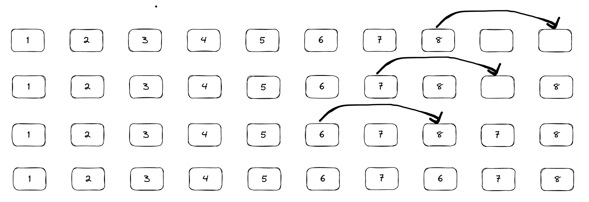

# 注意zhel第八天 ｜ 344、反转字符串 541、反转字符串II 剑指Offer05、替换空格 151、翻转字符串里的单词 剑指Offer58-II.左旋转字符串 

## 字符串知识点总结

字符串是若干字符组成的有限序列，也可以理解为是一个字符数组。字符串可以使用很多种方法去定义，如：

```cpp
// 当把一个字符串存入一个数组时，也把结束符 '\0'存入数组，并以此作为该字符串是否结束的标志。
char a[5] = "asd";
for (int i = 0; a[i] != '\0'; i++) {
}

// 在C++中，提供一个string类，string类会提供 size接口，可以用来判断string类字符串是否结束，就不用'\0'来判断是否结束。
string a = "asd";
for (int i = 0; i < a.size(); i++) {
}
```

那么vector< char > 和 string 又有什么区别呢？

其实在基本操作上没有区别，但是 string提供更多的字符串处理的相关接口，例如string 重载了+，而vector却没有。

所以想处理字符串，最好定义一个string类型，这样就可以使用更多的库函数。

下面是一些string类型的库函数操作：

```cpp
// 反转字符串 abc->cba
reverse(s.begin(), s.end());
reverse(s.begin() + i, s.begin() + j);

//扩充元素字符串大小
s.resize(s.size() + count);
```

## 344 反转字符串

#### 题目

题目链接：https://leetcode.cn/problems/reverse-string/

编写一个函数，其作用是将输入的字符串反转过来。输入字符串以字符数组 char[] 的形式给出。

不要给另外的数组分配额外的空间，你必须原地修改输入数组、使用 O(1) 的额外空间解决这一问题。

你可以假设数组中的所有字符都是 ASCII 码表中的可打印字符。

示例 1：
输入：["h","e","l","l","o"]
输出：["o","l","l","e","h"]

示例 2：
输入：["H","a","n","n","a","h"]
输出：["h","a","n","n","a","H"]

#### 思路

本题难度不大，直接使用双指针，两个指针分别指向字符串的最开始和最后面，再交换内容，知道两个指针相遇为止。

除此之外，在遇到其他想要反转字符串的题目的时候，也可以直接使用reverse函数来反转。

#### 代码

```cpp
class Solution {
public:
    void reverseString(vector<char>& s) {
        int left = 0;
        int right = s.size() - 1;
        while(left < right) {
            char tmp = s[left];
            s[left] = s[right];
            s[right] = tmp;
            left++;
            right--;
        }
    }
};
```

## 541 反转字符串II

#### 题目

题目链接：https://leetcode.cn/problems/reverse-string-ii/

给定一个字符串 s 和一个整数 k，从字符串开头算起, 每计数至 2k 个字符，就反转这 2k 个字符中的前 k 个字符。

如果剩余字符少于 k 个，则将剩余字符全部反转。

如果剩余字符小于 2k 但大于或等于 k 个，则反转前 k 个字符，其余字符保持原样。

示例:

输入: s = "abcdefg", k = 2
输出: "bacdfeg"

#### 思路

本题的思路是，可以讲字符串划分为多个长度为k的小块，如abcdefghijk可以被分为abc def ghi jk。

根据题意，对于第一个小块，需要反转，这可以直接使用reverse函数实现；对于第二个小块，不反转；对于第3个小块，反转。以此类推就会发现，对于奇数个小块，就反转，对于偶数个小块，不反转。因此，只需要去定位不同小块就行了。

定位小块可以使用小块中第一个元素的下标，每次循环下标+k，就可以定位到下一个小块了。

#### 代码

```cpp
class Solution {
public:
    string reverseStr(string s, int k) {
        int i = 0;
        while (i < s.size()) {
            int loop = i/k;
            //如果loop是偶数，那就反转
            if(loop%2 == 0) {
                // 如果最后一次反转的数量不够k个，那就反转到end()为止
                if (i + k > s.size())
                    reverse(s.begin() + i, s.end());
                else {
                    reverse(s.begin() + i, s.begin() + i + k);
                }
            }
            i = i + k;
        }
        return s;
    }
};
```

## 剑指Offer 05.替换空格

#### 题目

题目链接：https://leetcode.cn/problems/ti-huan-kong-ge-lcof/

请实现一个函数，把字符串 s 中的每个空格替换成"%20"。

示例 1： 输入：s = "We are happy."
输出："We%20are%20happy."

#### 思路

本题最简单的方法肯定是再新建一个字符串，然后从原字符串拷贝过去就行。

其实还有一种优化方法，使得可以在原字符串上面进行操作。

看到这题，其实就想到之前使用双指针解决删除数组元素的题目，这题很像，只是增加数组元素，也是两层循环，能否使用双指针来解决。

考虑使用一个指针去定位非空格的元素，一个指针进行拷贝。这样注意一点，增加操作需要从后往前。原因很简单，如果从前往后的话，那拷贝的过程，是把前面的数组往后面拷贝，比如把第3个拷贝到第5个，接下来再把第4个拷贝到第6个，接下来再把第5个拷贝到第7个。注意这里，第5个数据其实是从第3个拷贝过来的，已经被覆盖掉了，就不能再给第7个，应该是把之前的第5个数据交给第7个数据。如下图所示。


这个问题其实是因为相互覆盖导致的。那我如果考虑从后往前进行双指针操作，是不是就没有这个问题了。如下图所示。



由于被覆盖的位置已经被使用完了，使用就没有之前的问题。

因此，使用双指针法，使用快指针从后往前去查找是否有空格，如果有空格，慢指针处就加上%20，如果没有空格，就将快指针的内容复制给慢指针。注意一点，需要提前扩充数组到每个空格替换成"%20"之后的大小，否则，不知道快慢指针最开始初始化的位置。

#### 代码

```cpp
class Solution {
public:
    string replaceSpace(string s) {
        int count = 0;
        for (int i = 0; i < s.size(); i++) {
            if (s[i] == ' ')
                count++;
        }
        int fast = s.size() - 1;
        int slow = fast + count*2;
        // 扩充字符串s的大小，也就是每个空格替换成"%20"之后的大小
        s.resize(s.size() + count * 2);
        s[slow + 1] = '\0';
        while (fast != slow) {
            if (s[fast] != ' ') {
                s[slow] = s[fast];
                slow--;
                fast--;
            }
            else {
                s[slow] = '0';
                s[slow - 1] = '2';
                s[slow - 2] = '%';
                slow = slow -3;
                fast--;
            }
        }
        return s;
    }
};
```

## 151 翻转字符串里的单词

#### 题目

题目链接：https://leetcode.cn/problems/reverse-words-in-a-string/

示例 1：
输入: "the sky is blue"
输出: "blue is sky the"

示例 2：
输入: "  hello world!  "
输出: "world! hello"
解释: 输入字符串可以在前面或者后面包含多余的空格，但是反转后的字符不能包括。

示例 3：
输入: "a good  example"
输出: "example good a"
解释: 如果两个单词间有多余的空格，将反转后单词间的空格减少到只含一个。

#### 思路

本题想到，能不能先反转整个字符串，将后面的字符反转到前面来，再单独反转每一个单词，让单词恢复正确的顺序。

举个例子，源字符串为："the sky is blue "

- 移除多余空格 : "the sky is blue"
- 字符串反转："eulb si yks eht"
- 单词反转："blue is sky the"

解决了反转的问题，还要考虑意向，题目要求删除多余空格，所以还要在反转之前，去掉多余空格。在一个数组中删除特定元素，自然而然想到双指针，让fast指针去寻找不是多余空格的元素，让slow指针定位新数组的位置，被fast赋值。

因为空格位置有三种，所以fast需要有3种寻找方法。

- 对于最开始的空格，全部跳过，直到找到一个非空格元素
- 对于中间的连续空格，找到连续空格中最后一个空格的位置
- 对于最后面的空格，如果也是多个的话，找到最后一个空格位置，先赋值给slow，最后再判断字符串最后一位是不是空格，如果是直接删掉。

#### 代码

```cpp
class Solution {
public:
    void del_space(string &s) {
        int slow = 0;
        int fast = 0;
        while (s[fast] == ' ') {
            fast++;
        }
        while (fast < s.size()) {
            if (s[fast] != ' ')
            {
                s[slow] = s[fast];
                slow++;
                fast++;
            }
            else {
                // 如果有连续多个空格存在，找到最后一个空格，且只保留这最后一个空格
                // 如果s的最后几位都是空格，使用while定位到最后一个空格
                while (fast < s.size() - 1 && s[fast + 1] == ' ') {
                    fast++;
                }
                s[slow] = s[fast];
                slow++;
                fast++;
            }
        }
        // 由于上面赋值之后，slow++，所以导致slow比实际赋值的位置多1，这里减掉
        slow--;
        // 如果最后有空格，经过之前的赋值，仅把最后一个空格赋值下来，这里删掉
        if (s[slow] == ' ') {
            slow--;
        }
        // slow是下标，slow+1才是长度
        s.resize(slow + 1);
    }

    string reverseWords(string s) {
        // 先移除多余空格，保证字符串是“word1 word2 word3”的格式
        del_space(s);
        // 将整个字符串翻转
        reverse(s.begin(), s.end());
        // 识别空格，找到一个word，对word翻转
        int start = 0;
        int end = 0;
        while(end < s.size()) {
            // 找到word的最后一个字母的下标
            while (s[end + 1] != ' ' && end != s.size() - 1) {
                end++;
            }
            reverse(s.begin() + start, s.begin() + end + 1);
            start = end + 2;
            end = start;
        }
        return s;
    }
};
```

## 剑指Offer58-II.左旋转字符串

#### 题目

题目链接：https://leetcode.cn/problems/zuo-xuan-zhuan-zi-fu-chuan-lcof/

字符串的左旋转操作是把字符串前面的若干个字符转移到字符串的尾部。请定义一个函数实现字符串左旋转操作的功能。比如，输入字符串"abcdefg"和数字2，该函数将返回左旋转两位得到的结果"cdefgab"。

示例 1：
输入: s = "abcdefg", k = 2
输出: "cdefgab"

示例 2：
输入: s = "lrloseumgh", k = 6
输出: "umghlrlose"

限制：
1 <= k < s.length <= 10000

#### 思路

看到这题旋转字符串的题目，就想到上面一题选择字符串里的单词，其实这两题有点像，都是反转字符串的一部分。

看题目给的示例，发现将输出反转之后，结果为bagfedc，就很明显发现，以第二个字符为界限，反转前两个字符，和后面所有字符，就可以得到输入。

所以这题的做法是：

1. 反转区间为前n的子串
2. 反转区间为n到末尾的子串
3. 反转整个字符串

#### 代码

```cpp
class Solution {
public:
    string reverseLeftWords(string s, int n) {
       reverse(s.begin(), s.begin() + n);
       reverse(s.begin() + n, s.end());
       reverse(s.begin(), s.end());
       return s;
    }
};
```


